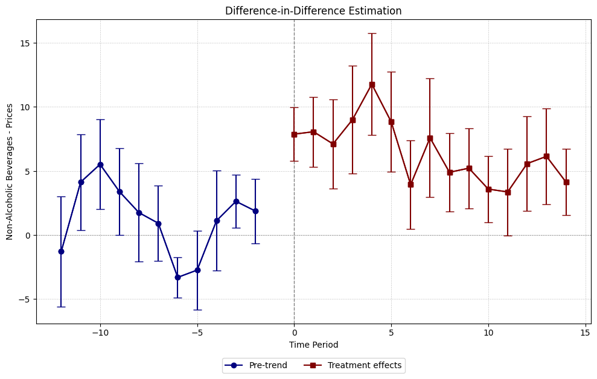
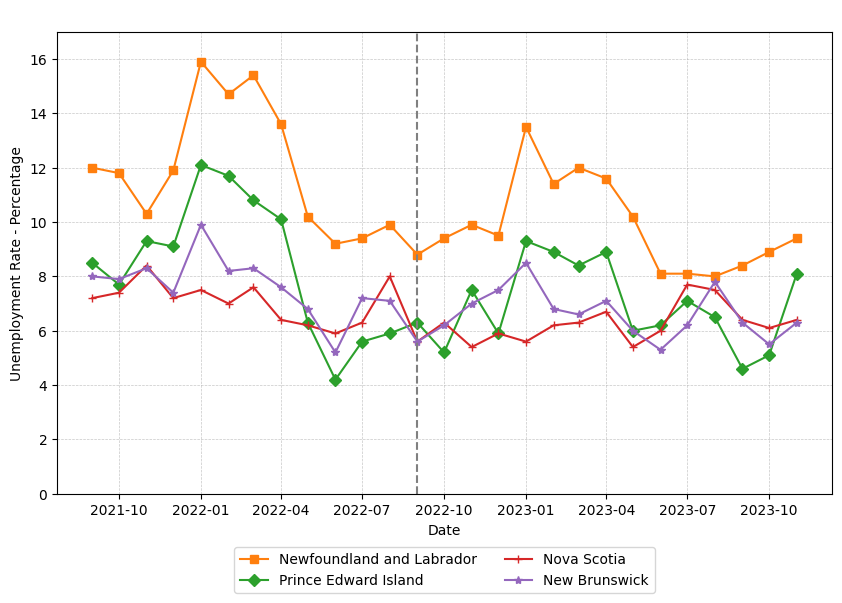
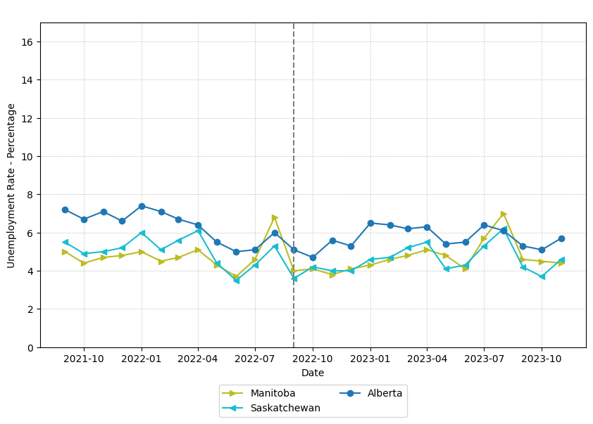
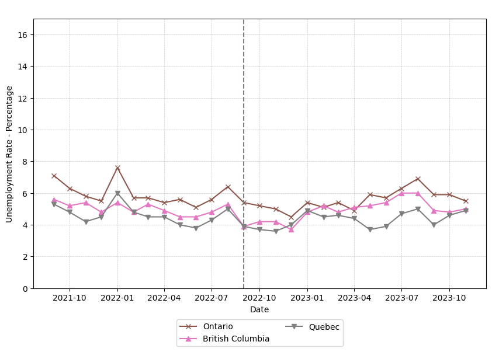
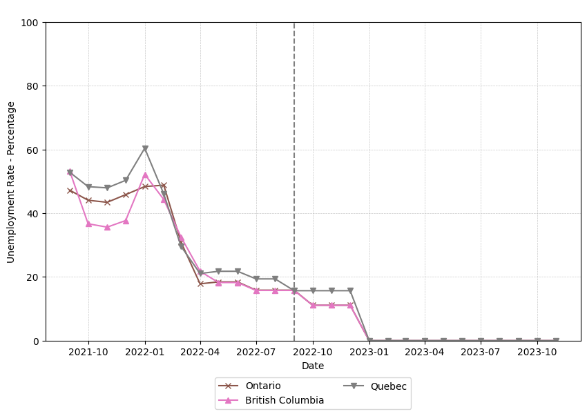
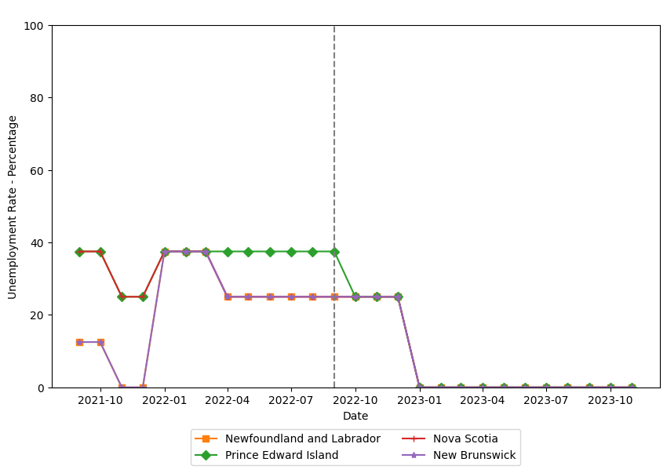
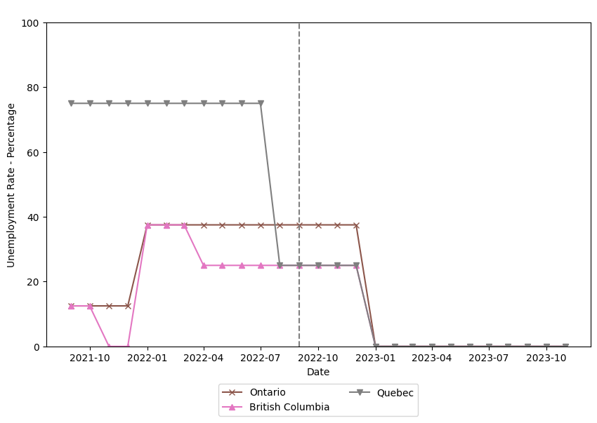

# The Effect of the Sweetened Beverage Tax on Non-Alcoholic Beverages in Newfoundland

*The objective of this project is solely to demonstrate how a difference-in-difference model and event study figures can be used to study tax incidence*

## Background

On September 1, 2022, [the Government of ***Newfoundland and Labrador*** (NL) introduced a tax on sugary drinks to encourage healthier beverage choices](https://healthydebate.ca/2023/03/topic/newfoundland-labrador-sugar-tax/#:~:text=Newfoundland%20and%20Labrador%20became%20the,1%2C%202022.). The provincial Government [has justified](https://www.gov.nl.ca/fin/files/21702_sugar_factsheet.pdf) the initiative by stating that it aligns with recommendations from key health organizations like the World Health Organization and Canada's Food Guide. The Province intends to use th revenue from the tax to support initiatives such as the Physical Activity Tax Credit and school meal programs, promoting better health outcomes for residents.

**The sugar tax of 20 cents per litre** is collected in addition to the provincial sales tax. The sugar tax is therefore levied on the drink's volume and not on the amount of sugar contained in the beverage. [The tax on sugary beverages includes ready-to-drink options such as](https://www.gov.nl.ca/fin/files/21702_sugar_factsheet.pdf):

- Soft drinks,
- Fruit-flavored drinks,
- Sports and energy drinks
- Dispensed beverages like soda fountain drinks, slush drinks, and fruit juices.

However, certain beverages are exempt from the tax:

- 100% natural fruit or vegetable juices
- Sugar-free sodas
- Chocolate milk
- Alcoholic beverages
- Syrups, purées, and powders used primarily for cooking or food preparation.
- Beverages prepared at the time of purchase in food and beverage establishments, such as sweetened coffee or tea.

[When it comes to concentrated drink mixtures](https://www.gov.nl.ca/fin/sugar-sweetened-beverage-tax/), including frozen concentrated sweetened fruit punches, flavoured drink crystals, powders, and syrups with added sugar, the a different rate can be applied. For beverages with clear preparation instructions, the tax applies at a rate of 20 cents per litre. However, for those lacking clear instructions, the tax is higher:

- 0.80 CAD per litre for frozen concentrated juices,
- 2.00 CAD per kilogram for flavoured powders,
- 1.20 CAD per litre for syrups.

This tax structure is supposed to incentivize manufacturers to provide clear preparation guidelines, thus facilitating informed consumer choices and promoting public health objectives.

## Objective

My objective in this project is to analyze and measure the effect of the ***Sugar-Sweetened Beverage tax*** on non-alcoholic beverages implemented in the Province of ***Newfoundland and Labrador***, Canada.

I will use the framework of a ***Difference-in-Difference*** (DID) econometric model to achieve that objective. A dynamic and static specification of the model will be considered. The dynamic specification will be used to verify the presence of any pre-trend that violates the assumptions of the model and the long-term effects of the tax. The static specification will be used to verify the magnitude of the effect of the tax, by controlling for covariates that could bias the estimation of the variable of interest.

## Methodology

The [difference-in-difference](https://www.sciencedirect.com/science/article/abs/pii/S1573446399030047) (DID) method is commonly used to determine if a particular event caused a change in a specific outcome and to quantify the size of this change. This method is used often for its simplicity and adaptability, making it easy to grasp and apply in various situations (Angrist et al, 1999). It also accounts for changes in the outcome that aren not directly caused by the event itself. However, there are limitations to consider. DID requires two sets of observations, one affected by the event and one not, in other words, a treatment and a control group, respectively. Certain assumptions must be met, including the independence of the event from the outcome variable and the stability of characteristics in both sets of observations. The most crucial assumption is that both sets of data follow a similar trend over time, also referred to as the **parallel trends assumption**. Despite these limitations, the DID method was selected for its ability to meet the research objectives effectively. For this project, I use the [non-alcoholic beverages](https://doi.org/10.25318/1810000401-eng) subset of the Canadian Consumer Price Index (CPI) as the dependent variable.

To formalize this approach I denote the ten Canadian provinces as $i \in \{1, 2, ..., 10\}$. The time variable is denoted as $t \in \{1, 2, ..., 27 \}$, these integers represent the monthly observations from September 2021 to November 2023. The dependent variable is represented by $Y_{it}$. The binary treatment variable is written as $D_{it} \in \{ 0, 1 \}$, where $D_{it} = 0$ means that province $i$ was not treated at time $t$ and $D_{it}$ means that province $i$ was treated at time $t$. The treatment period is denoted as $E_{i} = min\{t: D_{it} = 1\}$, this period is also referred to as "event time." I also define the variable $K_{it} = E_i - t$ as the ``relative time,'' which expresses time periods as a number relative to the event time. After considering this information, I can write the ***dynamic specification*** as Equation 1:

$$Y_{it} = \alpha + \beta_i + \delta_t + \sum_{k = -A}^Z \tau_k D_{it} + ϵ_{it} $$

Where $A \geq 0$ and $Z \geq 0$ represent the leads and lags of the treatment, respectively. Province fixed effects are denoted by $\beta_i$ and time fixed effects by $\delta_t$. The error term is shown as $\epsilon_{it}$ and errors are clustered at the province level. The constant term is represented by $\alpha$.

In the dynamic specification, the outcome of interest is $\tau_k$, which represents the time-varying effects of the sugar tax. To avoid issues of multicollinearity, I normalize the estimation by setting $\tau_{-1} = 0$.

To quantify the effect of the sugar tax on non-alcoholic beverages in NL, I use the static specification of the DID model. This specification can be written as Equation 2:

$$Y_{it} = \alpha + \beta_i + \delta_t + \tau D_{it} + X^\prime \gamma + \epsilon_{it}$$

Where a set of variables $X^\prime$ and estimators $\gamma$ are included in the model to control for covariates that could bias the estimation. In this specification, $\tau$ is the coefficient of interest, and it measures the average treatment effect of the sugar tax on non-alcoholic beverages.

## Results

We can first verify the validity of the parallel trends assumption by analyzing Figure 1. This figure suggests that non-alcoholic beverage prices are parallel between the provinces. Trends observed in one province can be observed in a similar way in other provinces at the same time. We can also see that there is a jump that happens in non-alcoholic beverage prices exactly when the sugar tax is implemented. It is important to note that, as of April 1, 2021, soda beverages no longer qualify for the Provincial Sales Tax (PST) exemption in British Columbia, resulting in the PST being applied to all retail sales of soda beverages at a rate of 7%. Since the period being considered here only includes the period between September 2021 to November 2023, this change should not interfere with estimations here, since the trends between NL and BC are not affected by this change in the BC legislation in the period considered.

**Figure 1**: Non-Alcoholic Beverage Price by Province.

Source: Statistics Canada. [Table 18-10-0004-01  Consumer Price Index, monthly, not seasonally adjusted](https://doi.org/10.25318/1810000401-eng)

We can see the results of the dynamic specification graphically by plotting $\tau_k$ from Equation 1. We can see the dynamic treatment effects plotted in Figure 2. We can see that the pre-trends do not present strong evidence of a systematic violation of the parallel trends assumption, as the lead coefficients are mostly not significantly different than zero. On the other hand, we can see that lag coefficients are significantly different than zero. **These results suggest that the implementation of the tax increase the price of non-alcoholic beverages in NL.**

**Figure 2**: The Effect of the Sugar Tax on Non-Alcoholic Beverages - Dynamic Specification.

Source: Author's Calculations.

Even though these results are promising and suggest that the tax was the reason for the increase in the dependent variable, the dynamic specification of DID does not provide a reliable measure of the magnitude of the sugar tax effect on the dependent variable. For that, I will consider the static model described in Equation 2. I will also need to control for other variables that could also have an effect on non-alcoholic beverage prices since the exclusion of variables that have an effect on the dependent variable and are correlated with the independent could introduce omitted variable bias in the model, which would make my estimates unreliable.

To prevent the issue of endogeneity mentioned in the last paragraph I included control variables. The reasoning behind their inclusion can be found in the Appendix section. These were the variables included in the static models:

- Unemployment;
- Average Weekly Earnings;
- Interest Rates;
- WTI Oil Prices;
- CAD/USD Exchange Rate;
- Stringency Index (SI);
- Economic Support Index (ESI);
- Geopolitical Risk Index (GPR).

The results obtained from the static model can be seen in Table 1. To verify the sensibility of the coefficient of interest on the dependent variable, Table 1 has various columns that consider different combinations of control variables. As we can see in Table 1, the effect of the implementation of the sugar tax increased the price of non-alcoholic beverages by 5.30 CAD in the extended model. We can also observe that the treatment variable is statistically significant in every variation of the model. **Figure 3 shows the results of the static model results with error bars**. These results suggest that the burden of sugar-sweetened beverage tax is being completely passed on to the final consumer.

**Table 1**: Static Model Results - Effect of the Sugar Tax on Non-Alcoholic Beverages.

Source: Author's Calculations.

**Figure 3**: Effect of the Sugar Tax on Non-Alcoholic Beverages - Error Bars.

Source: Author's Calculations.

## Conclusion

Overall the model I developed in this research suggests that non-alcoholic drinks in Newfoundland and Labrador increased by 5.30 CAD as a result of the implementation of the Sugar-Sweetened Beverage Tax. The extended model, which controls for seven other variables that can also affect the dependent variable, suggests that the tax increased non-alcoholic beverages at a minimum of roughly 3.00 CAD. **These results provide strong evidence that a disproportionately high portion of the tax burden is falling on the final consumer**.

High tax incidence on consumers is often related to factors such as inelastic demand or market power held by the firms. Inelastic demand implies that consumers are less responsive to price changes, which allows firms to raise prices without experiencing a significant decrease in demand. Additionally, if firms hold market power, they can exert control over prices, which enables them to shift a larger share of the tax burden onto consumers. **Several studies, however, show that the creation of a sugar-sweetened beverage tax decreases demand and that sugary drinks have elastic prices** ([1](https://doi.org/10.1016/j.ehb.2020.100869), [2](https://doi.org/10.1371/journal.pone.0277306), [3](https://doi.org/10.1186/1471-2458-13-1072), [4](https://doi.org/10.1177/1091142103253753), [5](https://doi.org/10.1007/978-3-319-33648-0_3), [6](https://doi.org/10.1001/jamanetworkopen.2022.15276) ). There is no consensus on market power being one of the main drivers of beverage inflation, since some reports point to a increase in profit margins in the period, while others point to no evidence of a mark-up increase ([7](https://centreforfuturework.ca/wp-content/uploads/2022/12/Fifteen-SuperProfitable-Industries.pdf), [8](https://www.ourcommons.ca/Content/Committee/441/AGRI/Reports/RP12503602/agrirp10/agrirp10-e.pdf)). 

Some explanations can be considered to explain the high-pass-through rate. It can be that the firms are facing higher costs and having difficulties when attempting to provide clear preparation guidelines for their products, thus running into higher tax rates. Another possible reason is that the demand for sugary drinks is relatively more inelastic in Newfoundland and Labrador than in other regions, since [the typical household allocates approximately 2.8 percent of its yearly food and beverage budget to sugar-sweetened beverages](https://www.gov.nl.ca/releases/2021/fin/1019n06/#:~:text=The%20average%20household%20in%20Newfoundland,Canadian%20average%20of%201.4%20percent.). This proportion stands as the highest among Canadian provinces, doubling the national average expenditure of 1.4 percent. This can be a sign that households in the Province have stronger preferences for sugary drinks. That being considered, it is still uncertain why the tax burden is being passed in excess to the final consumer.

Further studies should be done on the demand for non-alcoholic beverages in Newfoundland. If demand for sugary drinks is found to be inelastic, the Province must consider different policies to achieve the objective of incentivizing healthier beverage choices, since the sugar-sweetened beverage tax would have a limited effect on actual consumption. Studies on the costs associated with the provision of clear preparation guidelines for sugary drink products should also be done, as those could disproportionately impact smaller and local producers. Cost-benefit analysis studies should be performed to assess the net social benefit of this policy in the Province of Newfoundland and Labrador, as these would allow us to better understand if these policies are achieving their intended objectives.

**Summary of Conclusions**

1. Non-alcoholic beverage prices increased by roughly 5.30 CAD as a result of the sugar-sweetened beverage tax.
2. There is strong evidence that the tax burden is disproportionally falling on the final consumer.
3. It is still uncertain why the tax burden is being disproportionally passed to the final consumer. 
4. Most of the literature states that the demand for sugary beverages is elastic.
5. If the sugar tax is ineffective in reducing demand for sugar-sweetened drinks, the impact of the policy on social welfare is uncertain.
6. Research considering different control variables should be considered.

**My recommendations are the following**:

1. Conducting Cost-Benefit Analysis studies on the actual impact of the sugar-sweetened beverage tax on social welfare.
2. More studies on the effect of the Newfoundland and Labrador sugar-sweetened beverage tax effect on actual consumption.
3. The Government of Newfoundland and Labrador should consider complementary policies to achieve its objective of incentivizing healthier beverage choices.
4. Further studies that include different variables, not considered here, on the effect of the sugar-sweetened beverage tax.
5. Further studies should also be done about the possible existence of market power being held by the producers, which could lead to higher prices.

***Overall the results I show here should not be taken should not be taken at face value. The objective of this project is to showcase, in a simplified manner, how a difference-in-difference model can be applied to study tax incidence. Further research should be done about the subject.***

## Appendix

Eight different control variables were used in the extended model presented in Equation 2. The variables chosen as controls were: unemployment, average weekly earnings, WTI Oil prices, CAD/USD exchange rate, Stringency Index (SI), Economic Support Index (ESI) and the Geopolitical Risk Index. These control variables serve to mitigate potential confounding factors and account for external influences on beverage prices beyond the treatment effect of the tax. Unemployment and average weekly earnings reflect economic conditions and consumer purchasing power, while interest rates and oil prices capture broader macroeconomic trends that can affect production costs and inflationary pressures. Exchange rates can influence the competitiveness of Canadian products in the global market and the cost of imported goods and services. The SI and ESI were used to control the COVID-19 pandemic, which left lasting impacts on the global economy. The SI measures the strictness of the social distancing and lockdown measures, while the ESI measures the economic support measures adopted by the local government to mitigate the negative effects of the pandemic. The Geopolitical Risk Index is used to control for Geopolitical factors that affected markets worldwide, such as the Russian-Ukrainian invasion in 2022.

**Figure 4**: Monthly Unemployment Rate - Atlantic Provinces

Source: Statistics Canada. [Table 14-10-0287-03 - Labour force characteristics by province, monthly, seasonally adjusted](https://doi.org/10.25318/1410028701-eng)

**Figure 5**: Monthly Unemployment Rate - Prarie Provinces

Source: Statistics Canada. [Table 14-10-0287-03 - Labour force characteristics by province, monthly, seasonally adjusted](https://doi.org/10.25318/1410028701-eng)

**Figure 6**: Monthly Unemployment Rate - Ontario, Quebéc and British Columbia

Source: Statistics Canada. [Table 14-10-0287-03 - Labour force characteristics by province, monthly, seasonally adjusted](https://doi.org/10.25318/1410028701-eng)

**Figure 7**: Average Weekly Earnings by Province

Source: Statistics Canada. [Table 14-10-0223-01 - Employment and average weekly earnings (including overtime) for all employees by province and territory, monthly, seasonally adjusted](https://doi.org/10.25318/1410022301-eng)

**Figure 8**: Canadian Interest Rates

Source: [Bank of Canada. Canadian interest rates and monetary policy variables](https://www.bankofcanada.ca/rates/interest-rates/canadian-interest-rates/).

**Figure 9**: WTI Oil Prices

Source: [World Bank. Commodity Prices - "Pink Sheet" Table. Monthly Prices.](https://www.worldbank.org/en/research/commodity-markets)

**Figure 10**: CAD/USD Exchange Rate

Source: [Yahoo Finance. CAD/USD (CADUSD=X)](https://ca.finance.yahoo.com/quote/CADUSD=X/)

**Figure 11**: Stringency Index (SI) - Atlantic Provinces

Source: Edouard Mathieu, Hannah Ritchie, Lucas Rodés-Guirao, Cameron Appel, Charlie Giattino, Joe Hasell, Bobbie Macdonald, Saloni Dattani, Diana Beltekian, Esteban Ortiz-Ospina and Max Roser (2020) - "Coronavirus Pandemic (COVID-19)". Published online at OurWorldInData.org. Retrieved from: 'https://ourworldindata.org/coronavirus'.

**Figure 12**: Stringency Index (SI) - Prarie Provinces

Source: Edouard Mathieu, Hannah Ritchie, Lucas Rodés-Guirao, Cameron Appel, Charlie Giattino, Joe Hasell, Bobbie Macdonald, Saloni Dattani, Diana Beltekian, Esteban Ortiz-Ospina and Max Roser (2020) - "Coronavirus Pandemic (COVID-19)". Published online at OurWorldInData.org. Retrieved from: 'https://ourworldindata.org/coronavirus'.

**Figure 13**: Stringency Index (SI) - Ontario, Quebéc and British Columbia

Source: Edouard Mathieu, Hannah Ritchie, Lucas Rodés-Guirao, Cameron Appel, Charlie Giattino, Joe Hasell, Bobbie Macdonald, Saloni Dattani, Diana Beltekian, Esteban Ortiz-Ospina and Max Roser (2020) - "Coronavirus Pandemic (COVID-19)". Published online at OurWorldInData.org. Retrieved from: 'https://ourworldindata.org/coronavirus'.

**Figure 14**: Economic Support Index (ESI) - Atlantic Provinces

Source: Edouard Mathieu, Hannah Ritchie, Lucas Rodés-Guirao, Cameron Appel, Charlie Giattino, Joe Hasell, Bobbie Macdonald, Saloni Dattani, Diana Beltekian, Esteban Ortiz-Ospina and Max Roser (2020) - "Coronavirus Pandemic (COVID-19)". Published online at OurWorldInData.org. Retrieved from: 'https://ourworldindata.org/coronavirus'.

**Figure 15**: Economic Support Index (ESI) - Prarie Provinces

Source: Edouard Mathieu, Hannah Ritchie, Lucas Rodés-Guirao, Cameron Appel, Charlie Giattino, Joe Hasell, Bobbie Macdonald, Saloni Dattani, Diana Beltekian, Esteban Ortiz-Ospina and Max Roser (2020) - "Coronavirus Pandemic (COVID-19)". Published online at OurWorldInData.org. Retrieved from: 'https://ourworldindata.org/coronavirus'.

**Figure 16**: Stringency Index (SI) - Ontario, Quebéc and British Columbia

Source: Edouard Mathieu, Hannah Ritchie, Lucas Rodés-Guirao, Cameron Appel, Charlie Giattino, Joe Hasell, Bobbie Macdonald, Saloni Dattani, Diana Beltekian, Esteban Ortiz-Ospina and Max Roser (2020) - "Coronavirus Pandemic (COVID-19)". Published online at OurWorldInData.org. Retrieved from: 'https://ourworldindata.org/coronavirus'.

**Figure 17**: Geopolitical Risk Index (GPR)

Source: [Caldara, Dario and Matteo Iacoviello (2022), “Measuring Geopolitical Risk,” American Economic Review, April, 112(4), pp.1194-1225.](https://www.matteoiacoviello.com/gpr.htm)
